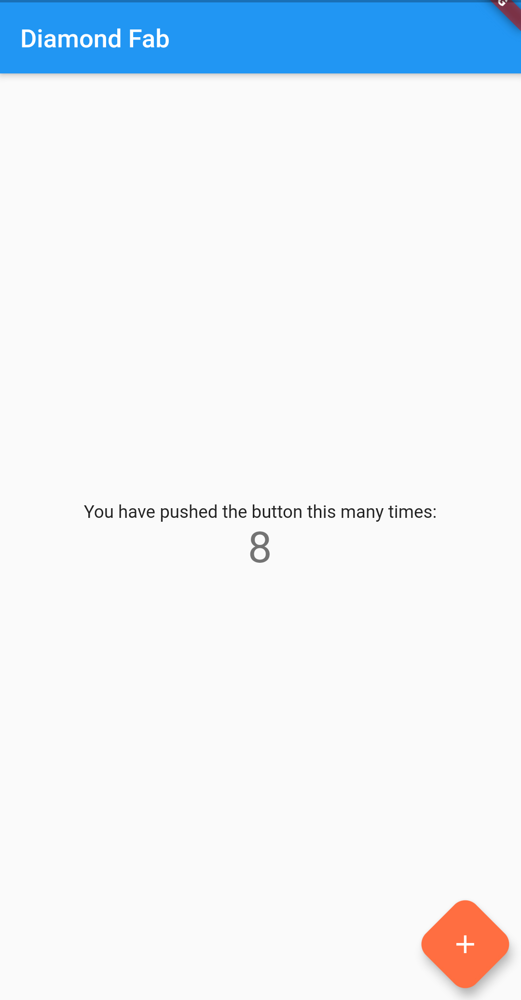
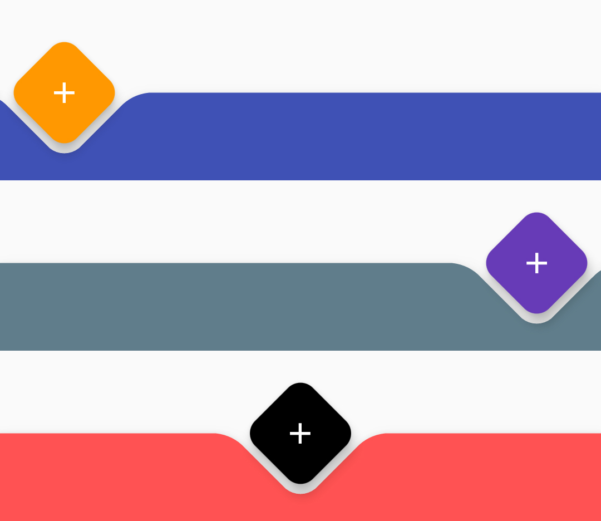

# Material Design Diamond FAB

A simple package for adding a Diamond Floating Action Button or FAB to a flutter application.  This FAB also allows for a notch to be made inside of the Bottom Application Bar or Bottom Navigation Bar based on the positioning. 

### Show some :heart: and star the repo to support the project

### Screenshots

 

## Usage

[Example](https://github.com/Jay53/Flutter-DiamondFab/blob/master/example/lib/main.dart)

To use this package :

* add the dependency to your [pubspec.yaml](https://github.com/Jay53/Flutter-DiamondFab/blob/master/example/pubspec.yaml) file.

```yaml
  dependencies:
    flutter:
      sdk: flutter
    diamond_notched_fab: ^0.0.1
```

# To set diamond shaped FAB 

```dart
//...
fabButton() =>  DiamondNotchedFab(
                onPressed: (){},
                backgroundColor: Colors.greenAccent,
                child: Icon(Icons.add),
                );
//...
```

# Fetch Songs

```dart
//...
bottomBar() =>  BottomAppBar(
                notchMargin: 8,
                shape: DiamondFabNotchedShape(),
                color: Colors.indigo,
                child: Container(height: 60.0),
                );
//...
```

### Created & Maintained By

[Jay Patel](https://github.com/Jay53)


## Getting Started

For help getting started with Flutter, view our online
[documentation](http://flutter.io/).
